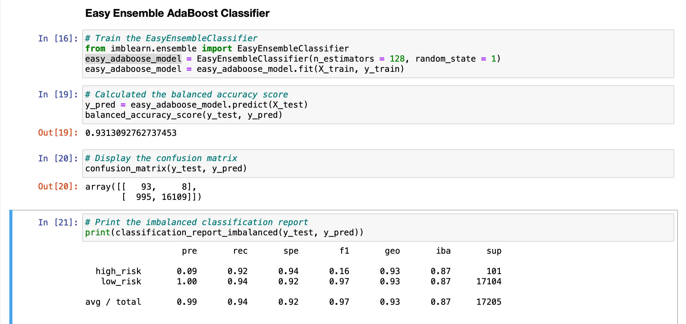

# Credit Risk Analysis

## Overview:

In this project, using the credit card credit dataset from LendingClub, a peer-to-peer lending services company, I oversampled the data using the **RandomOverSampler** and **SMOTE** algorithms and undersampled the data using the **ClusterCentroids** algorithm. Then, I used a combinatorial approach of over and undersampling using the **SMOTEENN** algorithm. Next, I compared two new machine learning models that reduce bias, **BalancedRandomForestClassifier**, and **EasyEnsembleClassifier**, to predict credit risk. Finally, I evaluated the performance of these models and made a written recommendation on whether they should be used to predict credit risk.

## Results:

### Random Over Sampler (Naive Random Oversampling) Model:

- Accuracy Score: 0.65
- Precision: 0.99 
- Recall: 0.56
- F1: 0.71

### SMOTE Oversampling Model:

- Accuracy Score: 0.65
- Precision: 0.99
- Recall: 0.69
- F1: 0.81

### Cluster Centroids Undersampling Model:

- Accuracy Score: 0.65
- Precision: 0.99
- Recall: 0.40
- F1: 0.56

### SMOTEENN (Combination (Over and Under) Sampling) Model:
 
- Accuracy Score: 0.54
- Precision: 0.99
- Recall: 0.57
- F1: 0.72

### Balanced Random Forest Classifier Model:

- Accuracy Score: 0.79
- Precision: 0.99
- Recall: 0.88
- F1: 0.93

### Easy Ensemble Classifier Model:

- Accuracy Score: 0.93
- Precision: 0.99
- Recall: 0.94
- F1: 0.97

## Summary:

Of all the six models, we can see that the **Easy Ensemble Classifier** model performs better than the others. At 0.93 Accuracy Score, it has the highest score. Following that model is the **Balanced Random Forest Classifier** model with a 0.79 Accuracy Score. Also, these two models get the highest F1 score - weighted average of the Recall and Precision score, at 0.97 and 0.93 scores, respectively.

With all of these high scores in Recall, Accuracy, and F1 scores, I would **recommend using the Easy Ensemble Classifier model** for the algorithm to predict credit risk for the LendingClub company.
